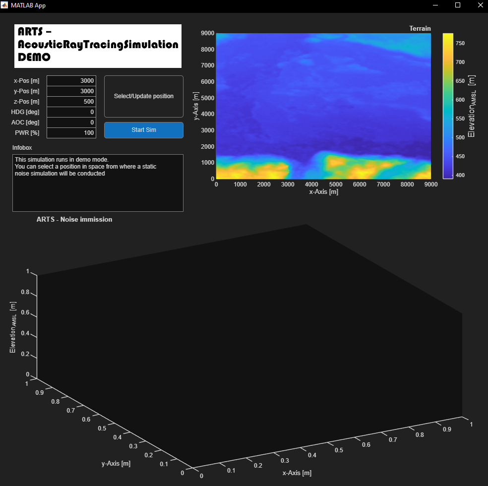
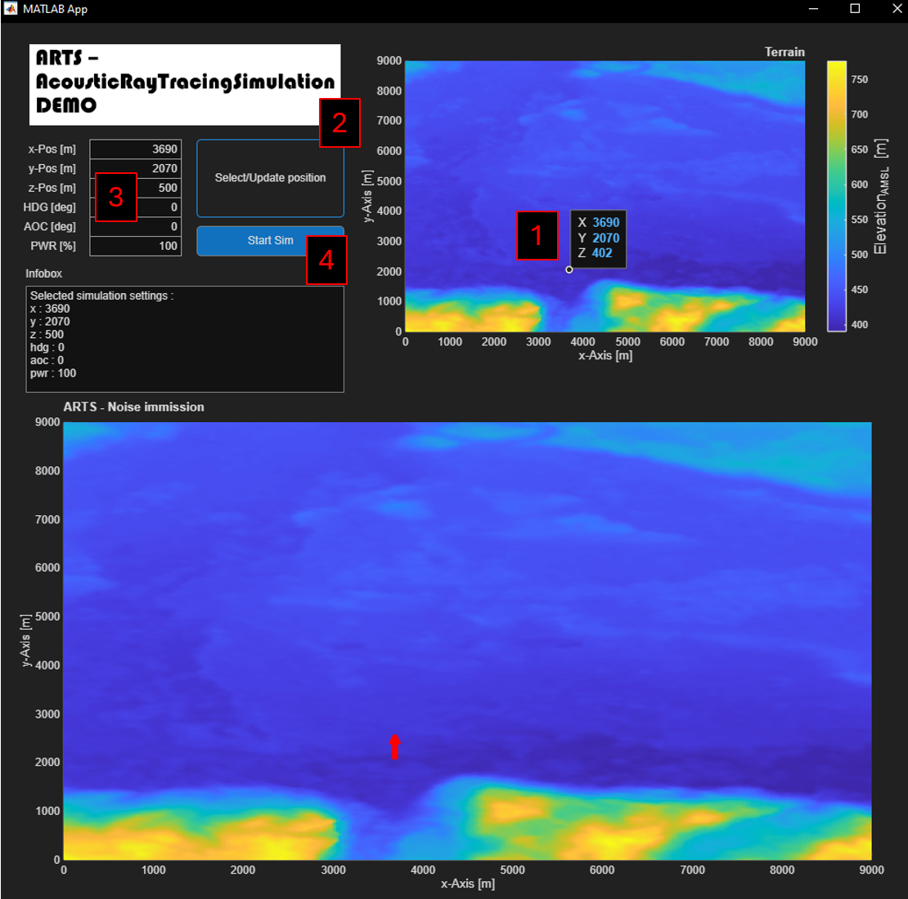
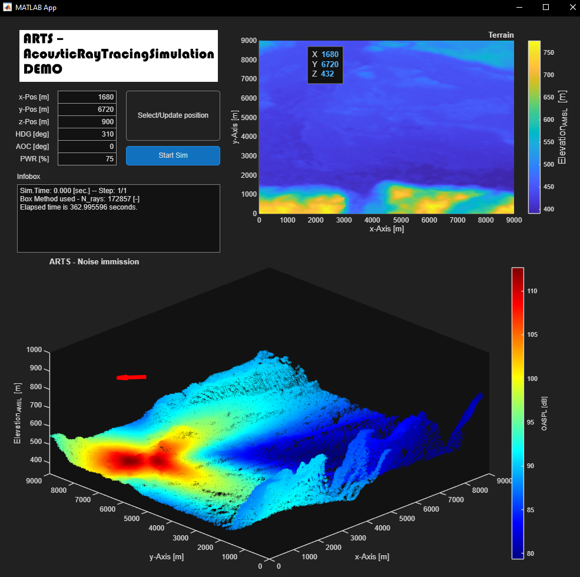
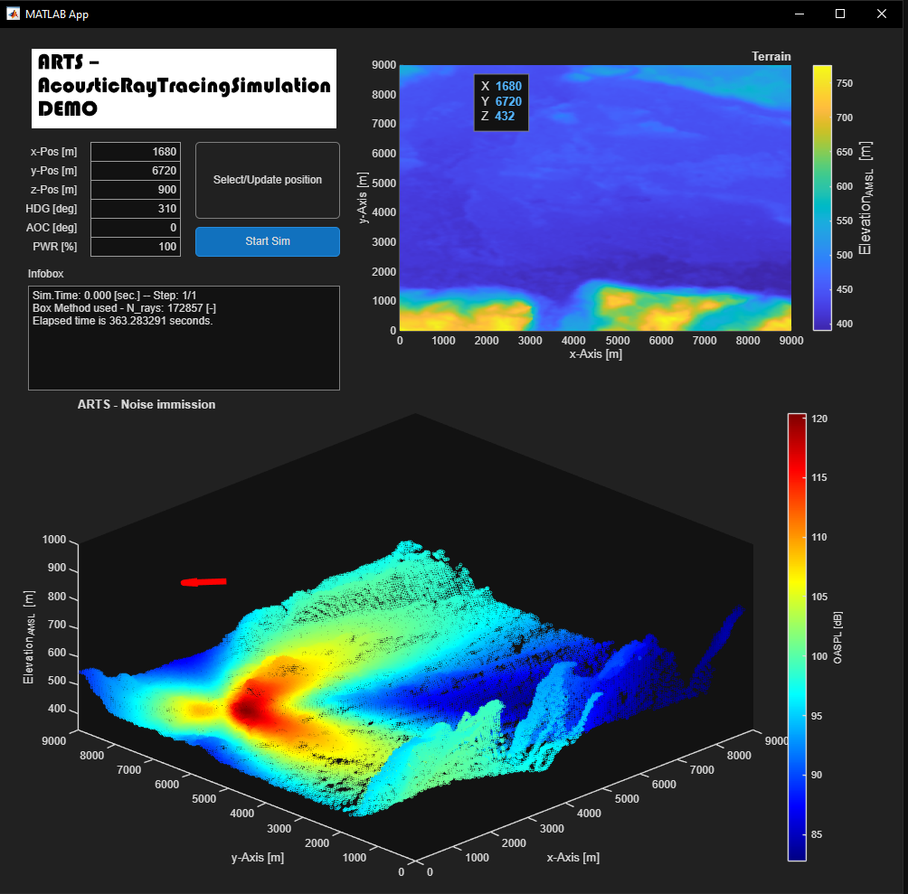
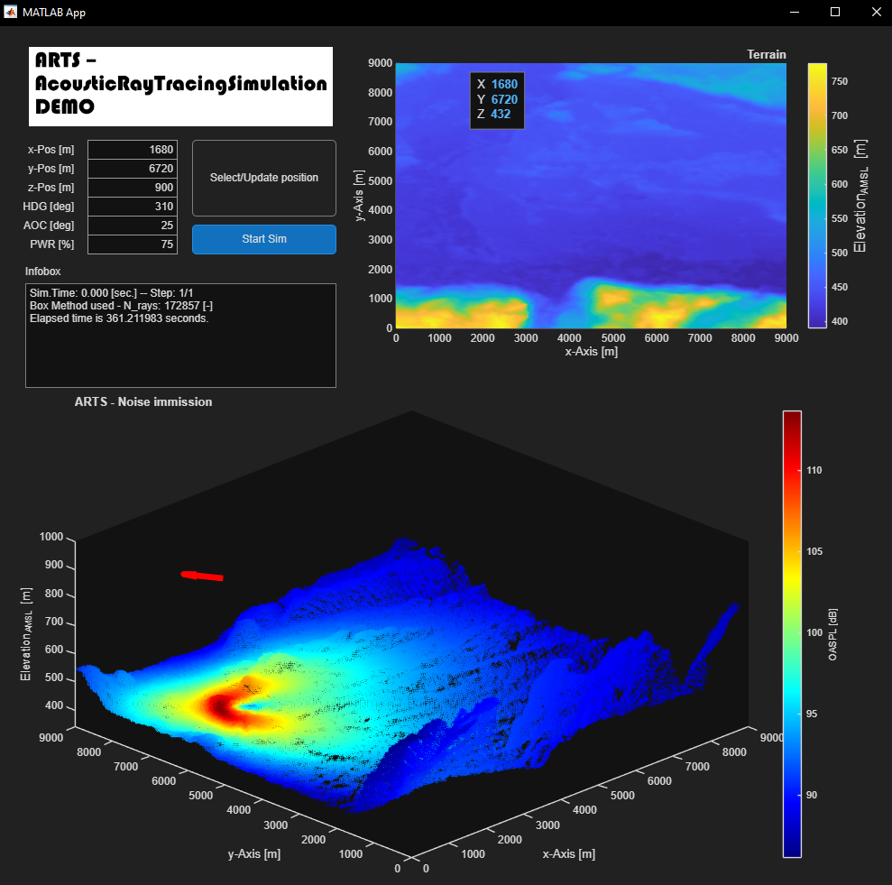
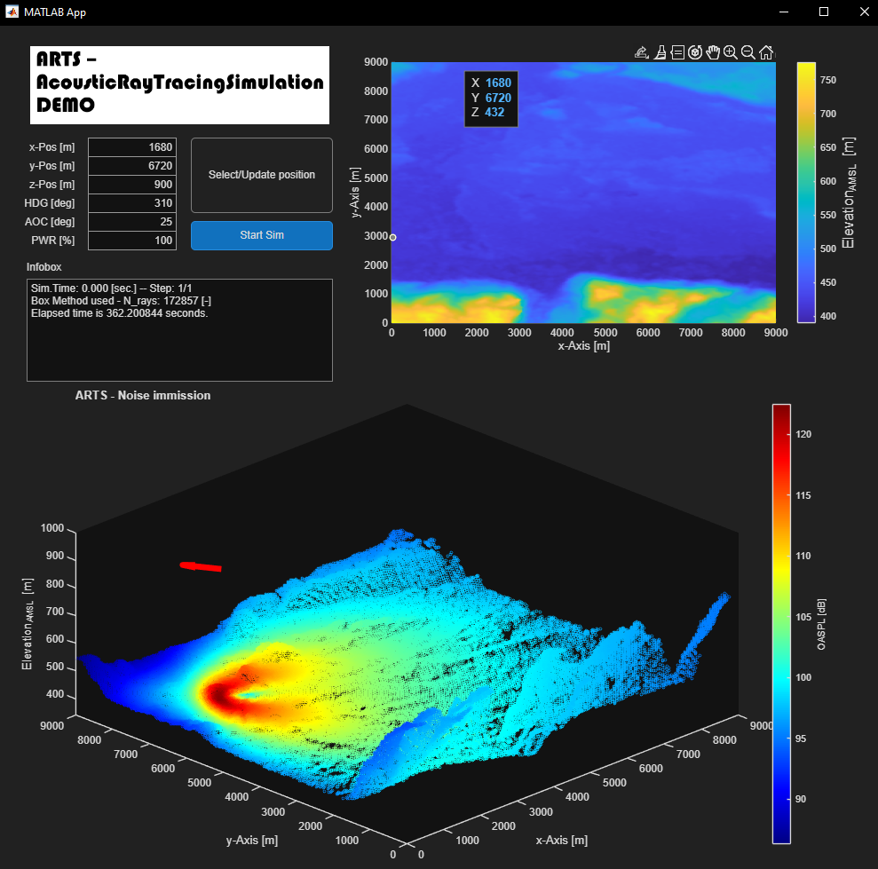

# ARTS - Acoustic Ray Tracing Simulation
High-fidelity aircraft noise simulation using dynamic acoustic ray tracing, atmospheric propagation and terrain interaction.

## Description
This is a demo for a noise simulation program, based on my Master Thesis of aircraft noise prediction [1].

It provides the posibility to conduct a noise simulation with dynamic source noise calculation, 
the propagation through the atmosphere and the immission on terrain. In contrast to the full simulation,
the demo will provide just a single step simulation in order to keep the run time reasonably short.

To ensure public usability, all emission models have been changed in order to run with non-sensitive data. Jet-
and fan-noise models have been derived from open literature by Heidmann and Lighthill [2,3]. The models
then have been parametrized for open source information of a Turbo-Union RB199 jet engine [4].

The used terrain data was obtained from OpenTopography.org [5] and represents the area surrounding Klagenfurt airport.

## Intended Use
This project serves as a technical demonstration of high-fidelity aircraft noise
simulation and acoustic ray tracing methods. It is intended for research,
engineering evaluation, and portfolio presentation purposes.

## Main functionality
- Dynamic source noise calculation with respect to engine power setting and attitude of the aircraft
- Emission model based on distance to terrain and attitude of aircraft with a variable number of emitted rays in order to achieve a constant ray density
- Transmission model based on acoustic ray tracing propagation with respect to atmospheric properties (temperature and wind profile) for sound refraction and dynamic cut-off conditions
- Immission model with respect to terrain elevation for dynamic immission detection and sound shielding

## Technical detail
- MATLAB App Designer (MLAPP)
- Parallel computing (MATLAB)
- Time-dependent acoustic ray propagation
- Dynamic emission ray generation and cut-off criteria
- Terrain-based immission detection and shielding effects

## What I Did
- Designed and implemented the complete acoustic ray tracing framework
- Developed dynamic noise emission models based on acoustic theory
- Implemented terrain-aware sound propagation and immission logic
- Optimized performance using parallel computing and cut-off logic
- Integrated real-world terrain data and atmospheric parameters

## Installation & how to use
- Clone the repository
- Open the main folder in MATLAB
- Run ARTS.mlapp (wait until the initialization process has finished, which will be indicated by the following infobox message: see screenshot)

- Set up a Simulation (see the added screenshot for reference)
1. Select a point on the terrain map from which the noise emission shall occur
2. Update the input data according to the point selected in the previous step
3. Adjust the input data in the text boxes if necessary and press the update button (e.g. select a different altitude, since the default setting is ground level) 
4. Start the simulation (duration: several minutes)

## Project structure
/SRC – Protected source code
/docs – Documentation/Screenshots
/geodata - Input terrain data
/input - Input data for basic demo
ARTS.mlapp - Main app

## Requirements
- MATLAB R2025b or newer (older versions might work as well)
- 16 GB system memory
- Parallel Computing Toolbox

## Screenshots
- The following screenshots show example results for different simulation settings  
-- Setting: AOC = 0 deg ; Power setting = 75 %  

-- Setting: AOC = 0 deg ; Power setting = 100 %  

-- Setting: AOC = 25 deg ; Power setting = 75 %  

-- Setting: AOC = 25 deg ; Power setting = 100 %  

## Reference
[1] J. Walter. Fluglärmsimulation mit Hilfe von Ray-Tracing unter Berücksichtigung von Gelände und Wetterdaten. Technische Hochschule Intolstadt, 2019. Master Thesis  
[2] M. Heidmann. Interim Prediction Method for Fan and Compressor Source Noise. NASA Technical Memorandum, 1979  
[3] M. Lighthill. On sound generated aerodynamically - I. General theory. The University Manchester, 1952  
[4] Wikipedia. Turbo-Union RB199. Website. https://en.wikipedia.org/wiki/Turbo-Union_RB199#cite_ref-Taylor610_13-2  
[5] OpenTopography. Website. https://portal.opentopography.org/raster?opentopoID=OTSDEM.032021.4326.3  

## Contact
Johannes Walter  
E-Mail : walter-johannes@gmx.de
